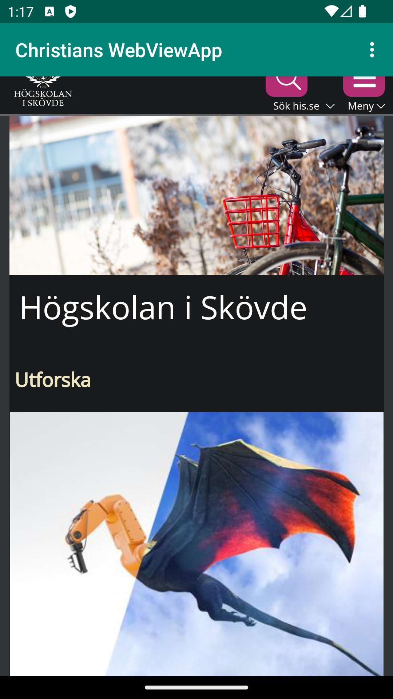
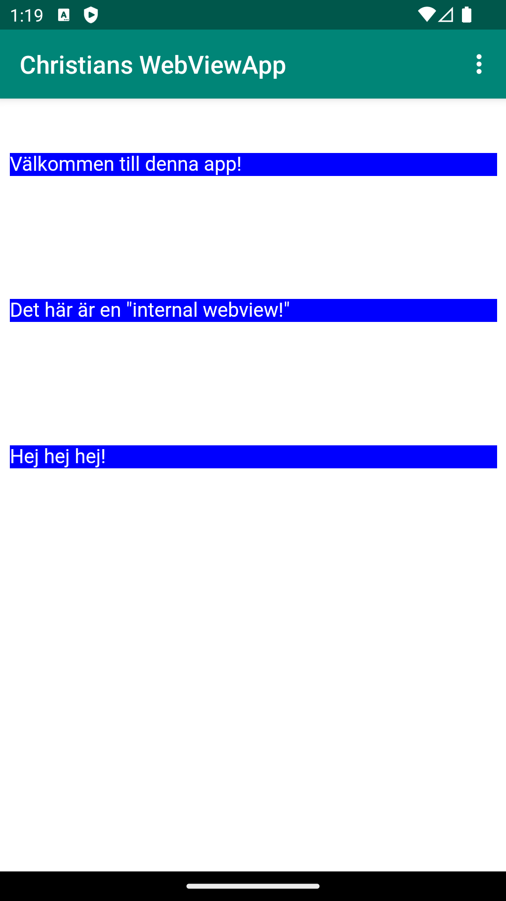

# Rapport

Ändrade namnet för applikationen till "Christians WebViewApp" och appen gavs tillåtelse att ansluta till internet i AndroidManifest.xml. 
```
 <uses-permission android:name="android.permission.INTERNET" />
```
Sedan byttes det existerande textview-elementet ut i layouten till ett Webview-element.
Detta Webview-element fick ett id i form av "my_webview" för att kunna koppla det till en variabel i java-koden. 
I java-koden så skapades en private variabel som heter "myWebView" som sedan användes för att koppla till variabeln "my_webview" för att sedan skapa 
en ny webview, för att inte öppna webföstret i extern webbläsare, och den gavs också tillåtelse att använda sig av javascript. 
```
    private WebView myWebView;
    ...
    myWebView = findViewById(R.id.my_webview);
    myWebView.setWebViewClient(new WebViewClient()); // Do not open in Chrome!
    myWebView.getSettings().setJavaScriptEnabled(true);

```
Det skapades även en ny html-fil i en asset-folder som sedan kunde länkas till senare. 
Sedan användes de redan skapade funktionerna "showExternalWebPage" och "showInternalWebPage" där URL för de önskade sidorna lades till.
Dessa funktioner lades sedan till i "onOptionsItemSelected" där menyknapparna redan fanns kopplade för external- och internal-webpage.
```
    public void showExternalWebPage(){
        myWebView.loadUrl("https://his.se");

    }
    public void showInternalWebPage(){
        
        myWebView.loadUrl("file:///android_asset/img/about.html");
    }
    ...

    ...
        if (id == R.id.action_external_web) {
            Log.d("==>","Will display external web page");
            showExternalWebPage();
            return true;
        }
        if (id == R.id.action_internal_web) {
            Log.d("==>","Will display internal web page");
            showInternalWebPage();
            return true;
        }
```



